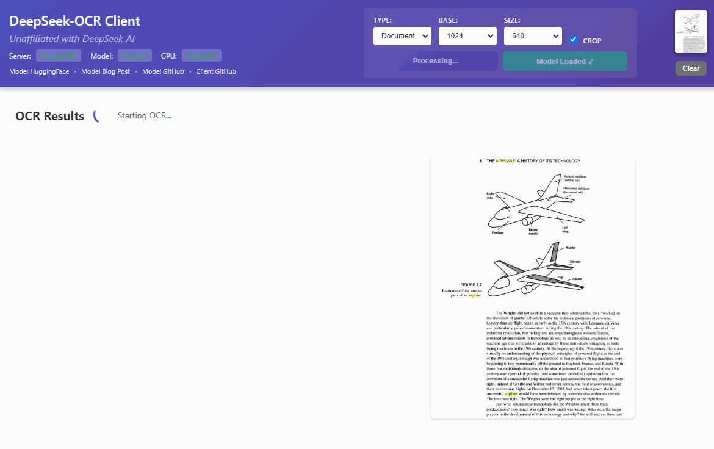
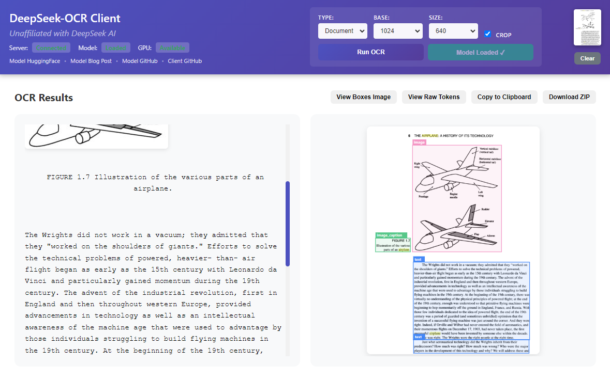

# DeepSeek-OCR Client

A real-time Electron-based desktop GUI for [DeepSeek-OCR](https://github.com/deepseek-ai/DeepSeek-OCR)

**Unaffiliated with [DeepSeek](https://www.deepseek.com/)**

## Features

- Drag-and-drop image upload
- Real-time OCR processing
- **Two OCR Engines:**
  - **Tesseract (CPU)** - Works without GPU, good for basic text extraction
  - **DeepSeek (GPU)** - Higher quality, requires NVIDIA GPU with CUDA
- **AI Text-to-Speech (TTS):**
  - **Edge TTS (CPU)** - Fast, free, 73+ languages including Arabic
  - **Coqui XTTS (GPU)** - Natural voice synthesis (optional)
  - Auto-detects language from OCR results

- Click regions to copy 
- Export results as ZIP with markdown images
- GPU acceleration (CUDA) for DeepSeek mode
- PDF OCR support
- Batch image processing

## Requirements

### For Tesseract Mode (CPU - No GPU needed)
- Windows 10/11, other OS are experimental
- Node.js 18+ ([download](https://nodejs.org/))
- Python 3.12+ ([download](https://www.python.org/))
- Tesseract OCR ([download](https://github.com/UB-Mannheim/tesseract/wiki)) - add to PATH after installation

### For DeepSeek Mode (GPU)
- All of the above, plus:
- Microsoft Visual C++ Redistributable ([download](https://aka.ms/vs/17/release/vc_redist.x64.exe))
- NVIDIA GPU with CUDA (8GB+ VRAM recommended)

## Quick Start (Windows)

1. **Extract** the [ZIP file](https://github.com/ihatecsv/deepseek-ocr-client/archive/refs/heads/main.zip)
2. **Run** `start-client.bat`
   - First run will automatically install dependencies.
   - Subsequent runs will start quicker.
3. **Select OCR Engine** - Choose "Tesseract (CPU)" or "DeepSeek (GPU)" from the dropdown
4. **Load Model** - Click the "Load Model" button (for DeepSeek) or it will verify Tesseract is installed
5. **Drop an image** or click the drop zone to select one.
6. **Run OCR** - Click "Run OCR" to process.
7. **Read Aloud** - After OCR, click "🔊 Read" to hear the text (select TTS engine from dropdown)

## Linux/macOS

**Note:** Linux and macOS have not been tested yet. Use `start-client.sh` instead of `start-client.bat`.

**PRs welcome!** If you test on Linux/macOS and encounter issues, please open a pull request with fixes.

## Links

- [Model HuggingFace](https://huggingface.co/deepseek-ai/DeepSeek-OCR)
- [Model Blog Post](https://deepseek.ai/blog/deepseek-ocr-context-compression)
- [Model GitHub](https://github.com/deepseek-ai/DeepSeek-OCR)

## Future goals (PRs welcome!)

- [ ] Code cleanup needed (quickly put together)
- [ ] TypeScript
- [ ] Updater from GitHub releases
- [x] PDF support
- [x] Batch processing
- [x] CPU support (Tesseract OCR)
- [x] Text-to-Speech (AI TTS)
- [ ] Web version (so you can run the server on a different machine)
- [ ] Better progress bar algo
- [ ] ???

## Troubleshooting
 
 ### "Read" Button Not Working / No Audio
 1. **Restart the app**: Ensure back-end dependencies are loaded.
 2. **Check Alerts**: The app shows popup alerts for TTS status.
 3. **Open DevTools**: Press **F12** to view the console logs for detailed error messages.
 4. **Internet Connection**: Edge TTS requires an active internet connection.
 
 ### "Internal Server Error" on TTS
 - This usually means a dependency is missing.
 - Try running `pip install edge-tts` manually if issues persist, or ensure `start-client.bat` has run fully.
 
 ## License

MIT
